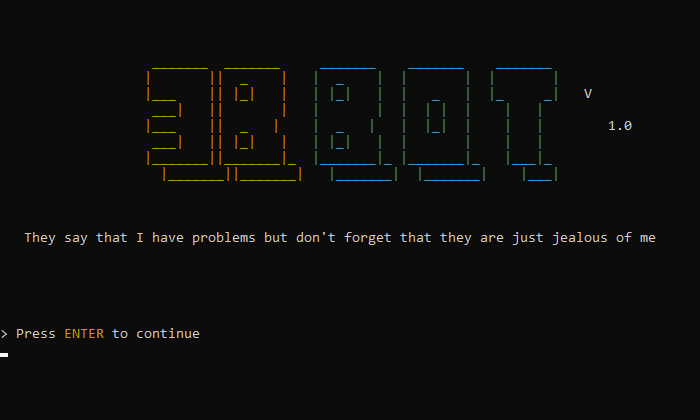

# 3B Bot (BiriBiriBot) in C

A chatbot with psychological problems - communicate with it if you're tough enough. This chatbot was created some years ago as a uni project. It is written in C and has many nice features. It can learn and forget things (like insertion and deletion in a database) but by using circular singly linked lists in C. It can answer questions about what it knows and random questions sometimes too

# Features

- learn this > concept: explanation"
 for example: learn this > albedo: Albedo is the measure of the diffuse reflection of solar radiation out of the total solar radiation and measured on a scale from 0, corresponding to a black body that absorbs all incident radiation, to 1, corresponding to a body that reflects all incident radiation.
- read this > file 
 for example: read this > wiki_100k.txt
- forget this > concept
 for example: forget this > albedo
- \*concept\*? -> to ask 3b about a concept it knows
 for example: \*albedo\*?   or do you know about \*albedo\*? e.t.c
- What do you know about?
- What do you talk about?
- What is the meaning of Life, The Universe, and Everything? (kind of an easter egg)
- So Long, and Thanks for All the Fish  -> this command exits the programme

 
# Images - Examples

# Copyright and License

- **[GPL version 3 license](https://opensource.org/licenses/GPL-3.0)**
- Copyright 2020 © <a href="https://github.com/NasosG" target="_blank">NasosG</a>.

**Thanks for reading**